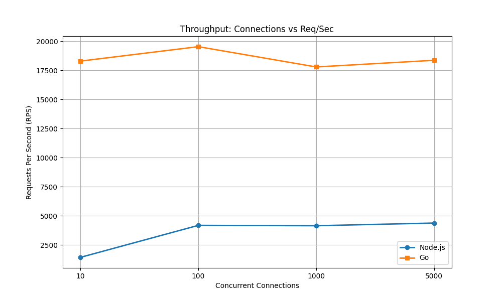
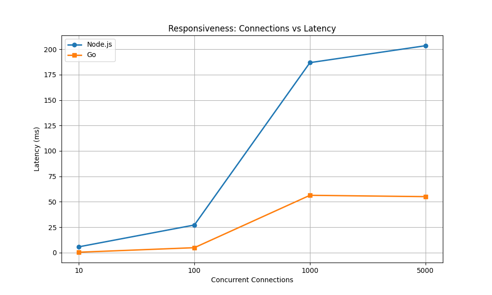
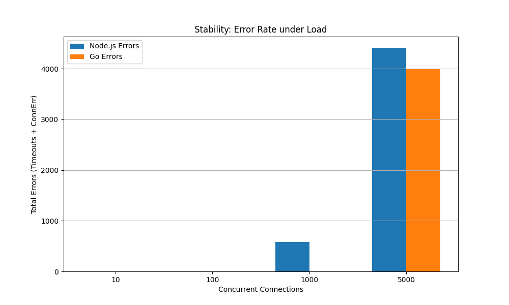

# API Gateway: Node.js vs. Go

## Overview
This project is an API Gateway implementation designed specifically to test and compare the fundamental architectural differences between Node.js and Go. The primary goal is to benchmark how well the Node.js single-threaded Event Loop performs against Go's multi-threaded concurrency model (Goroutines) under various load conditions.

## Architectural Comparison
By stressing both implementations with high-throughput traffic, this project evaluates:
*   **Node.js (Event Loop):** How queueing theory affects latency when a single core is saturated with CPU-bound and I/O-bound tasks.
*   **Go (Goroutines):** How lightweight threads distribute work across multiple CPU cores, and how that impacts memory footprints and concurrent connection scaling.

## Project Details & Workload
To ensure the benchmarks reflect a real-world API Gateway rather than just a simple "Hello World" test, the following features are implemented:

*   **JWT Verification:** Simulates heavy, CPU-bound cryptographic mathematical operations.
*   **Token Bucket Algorithm:** Implements robust rate-limiting, which is a core responsibility of any production API Gateway.
*   **Redis Integration:** The Token Bucket state is managed via Redis. This was done to simulate a real-world use case, reflecting how actual API Gateways handle distributed rate-limiting and network I/O downstreams.

## Metrics Evaluated
Through continuous load testing (using tools like `wrk`), the project tracks:
*   **Requests Per Second (RPS):** The absolute throughput limits.
*   **Latency:** How response times degrade as concurrent connections increase.
*   **Stability:** Error rates (timeouts and connection drops) when the server is pushed beyond its limits.

## Benchmark Methodology
To ensure a mathematically fair, apples-to-apples comparison, the benchmark strictly isolates both architectures:
*   **1-Core Hardware Constraint:** Both the Node.js and Go servers are pinned to a single CPU core using the Linux `taskset` command. This ensures Go's performance is measured by its scheduler efficiency, not purely by its hardware advantage of utilizing multiple CPU cores.
*   **Load Generation:** The `wrk` tool is used to simulate 10, 100, 1000, and 5000 concurrent TCP connections for 30 seconds each, aggressively pushing each server to its breaking point.

## Benchmark Results (1-Core Constraint)

### 1. Throughput (Requests Per Second)

*Node.js flatlines around ~4,200 RPS as the single-threaded Event Loop becomes saturated with JWT cryptography. Go successfully scales to ~18,500 RPS by efficiently context-switching Goroutines during Redis I/O waits.*

### 2. Responsiveness (Latency)

*As connections increase to 1,000, Node.js latency explodes beyond 180ms due to requests queueing behind the single thread. Go maintains a highly stable ~50ms latency under the same extreme load.*

### 3. Server Stability (Error Rates)

*At 1,000 concurrent connections, Node.js begins dropping requests (Timeouts) because the application queue is overwhelmed. Go experiences zero timeouts. At 5,000 connections, both architectures finally hit the operating system's physical TCP socket limit (Connection Errors).*

## Prerequisites & Tech Stack
To run these benchmarks locally, your system must have the following installed:
*   **Linux Environment:** Required for the `taskset` command to strictly restrict CPU core usage.
*   **Node.js** (v18+ recommended)
*   **Go** (v1.20+ recommended)
*   **Docker:** Required to easily spin up a local Redis instance.
*   **wrk:** A modern HTTP benchmarking tool.
*   **Python 3:** Required for graphing. You will need the `pandas` and `matplotlib` libraries (`pip install pandas matplotlib`).

## Running the Benchmarks
The repository includes automated scripts to run the tests and generate visualizations. Follow these steps to reproduce the benchmarks on your own machine:

**1. Clone the repository**
```bash
git clone https://github.com/Abdu-Rauf/API_Gateway.git
cd API_Gateway
```

**2. Start the Redis Server**
Spin up a Redis instance using Docker on the default port `6379`.
```bash
docker run -d -p 6379:6379 --name redis-benchmark redis:alpine
```

**3. Run the benchmarking bash script**
This will autonomously compile the Go server, run both servers on Core 0, execute `wrk`, and save the combined data to `results.csv`.

> **Note:** You can modify `runbenchmark.sh` to tweak the `wrk` parameters (like threads `-t` and connections `-c`) or adjust the `taskset` options to utilize more CPU cores depending on your PC's hardware capabilities.

```bash
chmod +x runbenchmark.sh
./runbenchmark.sh
```

**4. Generate the graphs**
To avoid system Python conflicts, it is recommended to run the graphing script inside a virtual environment.
```bash
# Create and activate a virtual environment
python3 -m venv venv
source venv/bin/activate

# Install dependencies
pip install pandas matplotlib

# Run the graphing script from inside the benchmark directory
cd benchmark
python benchmark.py

# Deactivate the virtual environment when finished
deactivate
```
The script will parse `results.csv` and output `throughput.png`, `latency.png`, and `errors.png` directly into the `benchmark` directory.